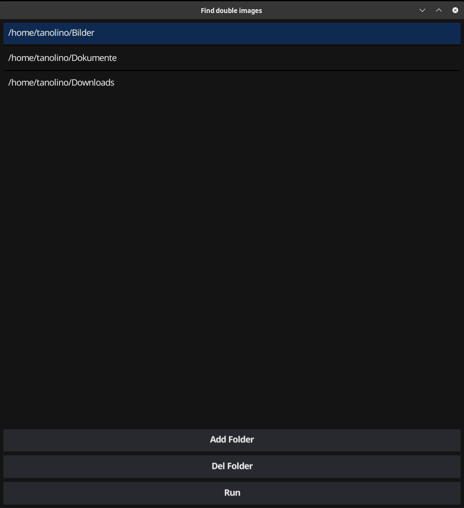

# goImgCmp

This is a simple tool to compare images in folders recursively.

So far we support:
* png
* jpeg
* webp
* gif (not very well)

A huge thanks to the following dependencies:
* https://developer.fyne.io/
* https://pkg.go.dev/image
* https://pkg.go.dev/golang.org/x/image/webp

Screenshots:

